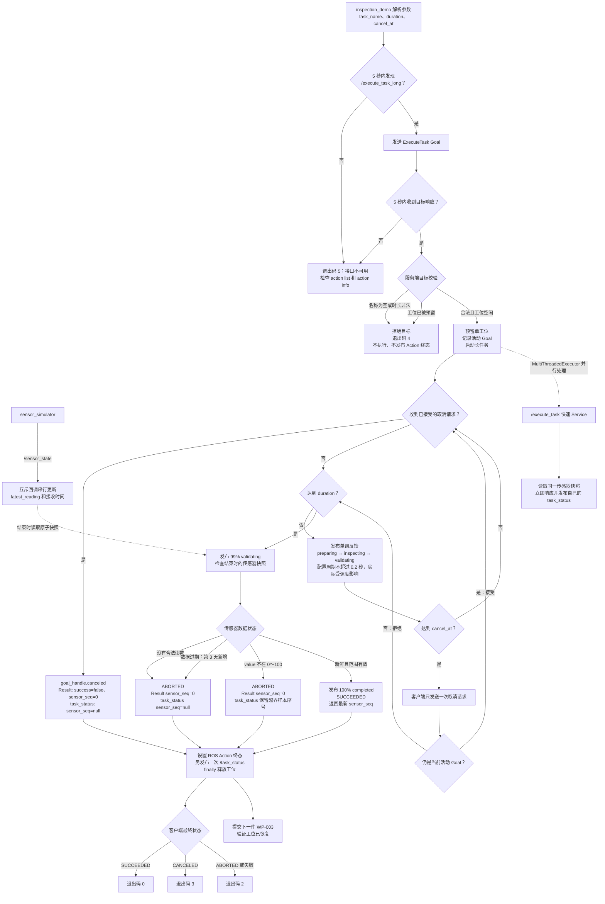

# 第 3 周第 1 天：长任务 Action、取消与恢复

这张图从 `inspection_demo` 客户端出发，覆盖目标校验、单工位并发保护、阶段反馈、取消、成功/中止终态以及取消后的恢复生产。图中陈旧数据分支是第 3 天后来加到同一个执行器中的保护，特意标出以保持流程图与当前代码一致。



## 最短调试路径

```text
找不到 Action
  → source install/setup.bash
  → ros2 action list -t
  → ros2 action info /execute_task_long

目标被拒绝
  → 检查空 task_name、duration 范围、是否已有活动目标

反馈停止或取消不生效
  → 同时检查客户端反馈和 task_executor 日志
  → 确认多线程执行器仍运行、目标仍是当前活动 Goal

终态异常
  → 对照 Action 状态、Result、/task_status、客户端退出码
  → 检查 /sensor_state 是否存在、越界或过期

取消后工位卡死
  → 立即提交 WP-003
  → 若被拒绝，检查 finally 是否释放 _goal_reserved
```

对应实现与证据：

- [Action Server 与快速 Service](../../ros2_ws/src/embodied_comm/embodied_comm/task_executor.py)
- [演示客户端](../../ros2_ws/src/embodied_comm/embodied_comm/inspection_demo.py)
- [自定义 Action 接口](../../ros2_ws/src/embodied_interfaces/action/ExecuteTask.action)
- [第 1 天实验记录](../labs/week03-day1-action.md)
