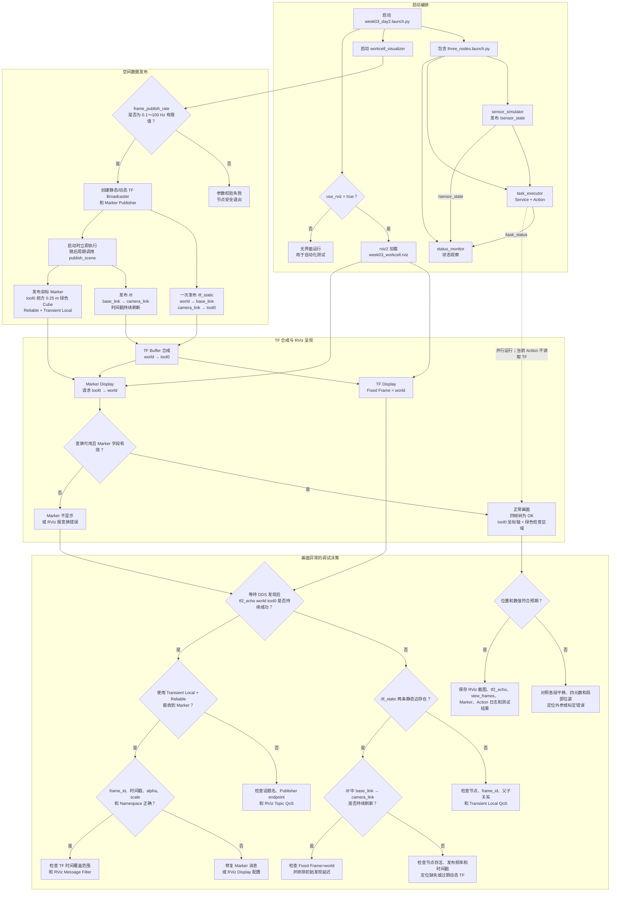

# 第 3 周第 2 天：TF 坐标树与 RViz 工位

这张图把启动编排、TF/Marker 发布、RViz 合成显示和画面异常定位放在同一条路径中。最重要的边界是：Action 与空间可视化目前只是并行运行，Action 成功还不能证明空间定位正确。



## 最短调试命令

```bash
ros2 run tf2_ros tf2_echo world tool0
ros2 topic echo /tf_static --qos-durability transient_local --once
ros2 topic hz /tf
ros2 topic echo /inspection_target_marker visualization_msgs/msg/Marker \
  --qos-durability transient_local --qos-reliability reliable --once
ros2 run tf2_tools view_frames -t 5 -o /tmp/week03_frames
```

判断顺序是“整链是否连通 → 静态边 → 动态边 → Marker 消息与 QoS → RViz 配置 → 数值是否正确”。刚启动 `tf2_echo` 时出现一次 `frame does not exist` 可能只是 DDS 发现延迟，持续失败才是故障。

对应实现与证据：

- [TF 与 Marker 发布器](../../ros2_ws/src/embodied_comm/embodied_comm/workcell_visualizer.py)
- [Day 2 Launch](../../ros2_ws/src/embodied_comm/launch/week03_day2.launch.py)
- [RViz 配置](../../ros2_ws/src/embodied_comm/config/week03_workcell.rviz)
- [第 2 天实验记录](../labs/week03-day2-tf-rviz.md)
