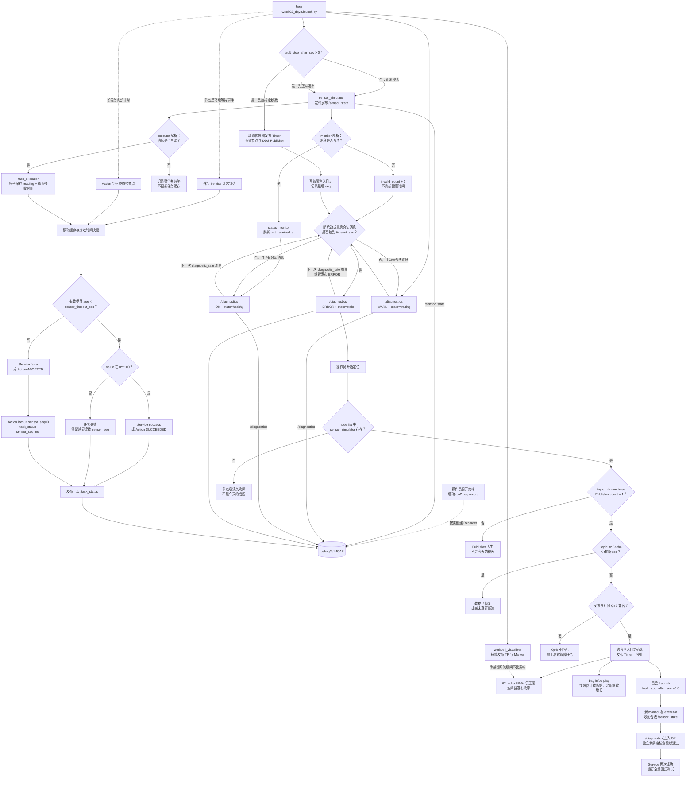

# 第 3 周第 3 天：健康诊断、话题停止与 rosbag

这张图同时覆盖正常数据流、可复现的话题停止、diagnostics 状态转换、任务新鲜度联锁、现场根因定位、恢复和回归测试。



## 最短调试命令

```bash
ros2 node list
ros2 topic info /sensor_state --verbose
ros2 topic hz /sensor_state
ros2 topic echo /diagnostics diagnostic_msgs/msg/DiagnosticArray
ros2 service call /execute_task std_srvs/srv/Trigger "{}"
ros2 run tf2_ros tf2_echo world tool0
ros2 bag info /tmp/week03_day3_topic_stop
```

关键判断不是“话题名是否存在”，而是“端点是否存在、消息是否仍更新、QoS 是否兼容、最后合法消息的年龄是多少”。诊断中的业务字符串为 `state=stale`，但等级是 `DiagnosticStatus.ERROR`，因为监控器自身仍在正常发布诊断。

对应实现与证据：

- [故障注入](../../ros2_ws/src/embodied_comm/embodied_comm/sensor_simulator.py)
- [标准健康诊断](../../ros2_ws/src/embodied_comm/embodied_comm/status_monitor.py)
- [陈旧数据联锁](../../ros2_ws/src/embodied_comm/embodied_comm/task_executor.py)
- [真实 DDS 集成测试](../../ros2_ws/src/embodied_comm/test/test_health_diagnostics.py)
- [第 3 天实验记录](../labs/week03-day3-health-topic-stop.md)
