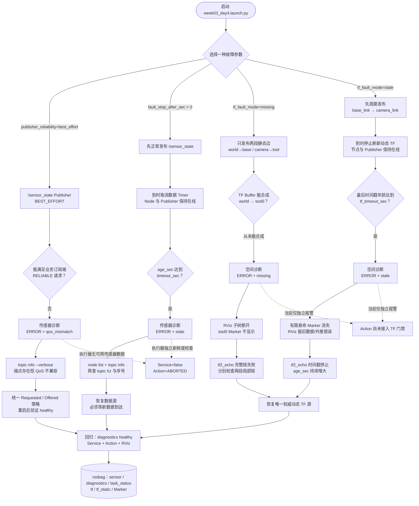

# 第 3 周第 4 天：QoS、话题停止与 TF 故障流程

本图把四种注入分成“传感器通信链”和“空间 TF 链”。调试时先根据 `/diagnostics` 的 `status.name` 选择链路，再用稳定的 `state` 缩小根因。

## 最短定位表

| 诊断状态 | 端点 | 数据/时间戳 | RViz | 首查方向 |
|---|---|---|---|---|
| `qos_mismatch` | `/sensor_state` Publisher 存在 | 业务订阅端从未收到 | TF 画面正常 | Requested/Offered QoS |
| 传感器 `stale` | 节点与 Publisher 存在 | 序号先增长后停止 | TF 画面正常 | 数据 Timer、驱动、上游采集 |
| TF `missing` | TF 发布节点存在 | 完整链从未形成 | 子树断开、Marker 不显示 | 缺失边、frame_id、父子关系 |
| TF `stale` | TF Publisher 存在 | 动态 TF 时间戳先增长后停止 | 目标消失或旧数据错误 | 定位线程、时钟、发布频率 |

恢复后不要只验证故障项；应同时检查两个诊断项均为 `healthy`、完整 TF 链可查、RViz 目标存在，并运行 Service 与 Action 回归。
