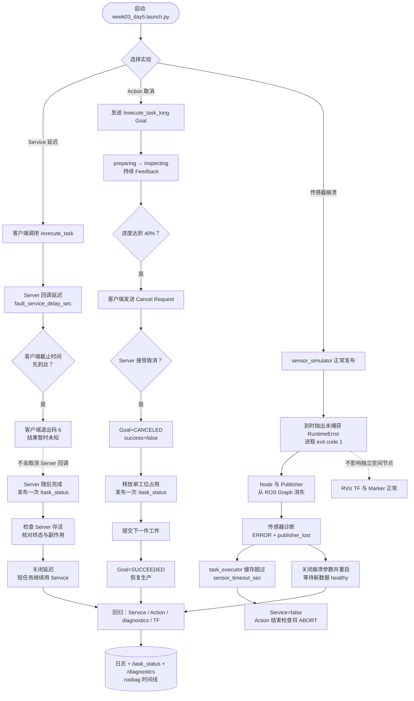

# 第 3 周第 5 天：Service 超时、Action 取消与节点崩溃

本图把三种故障按层次分开：Service 超时是客户端时限，Action 取消是目标生命周期转换，节点崩溃是进程和 DDS 端点消失。

## 调试映射

| 现象 | ROS Graph | 终态或诊断 | 首查方向 |
|---|---|---|---|
| Service 客户端超时 | Server 仍存在 | 客户端无响应，Server 稍后可能发布终态 | 客户端截止时间、Server 延迟、幂等性 |
| Action 被取消 | Action Server 存在 | `CANCELED`，一条失败 `/task_status` | Cancel Request、Server 接受与资源释放 |
| 传感器节点崩溃 | Node 与 Publisher 消失 | `publisher_lost`，缓存随后过期 | Launch 退出码、异常栈、进程监管 |

Service 超时不能根据客户端表象推断 Server 没有执行；Action 取消必须等待协议终态；节点崩溃则需要把 ROS Graph、诊断和 Launch 进程日志放在同一条时间线上。
