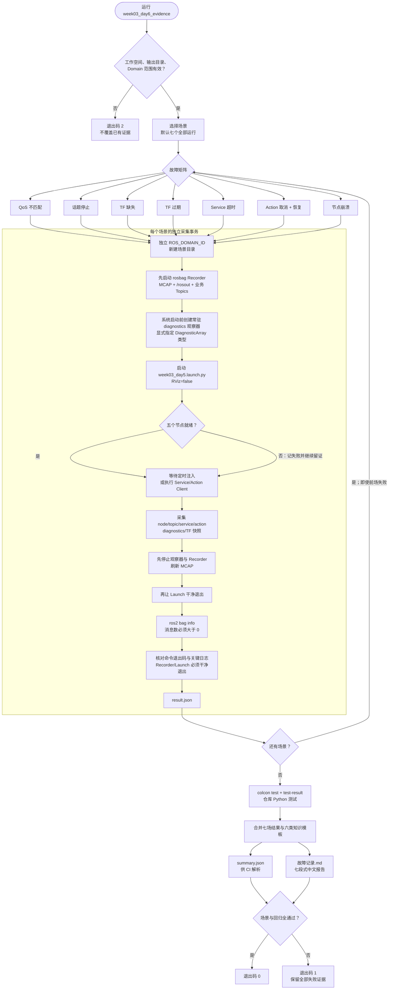

# 第 3 周第 6 天：自动证据流水线

本图描述六类故障如何展开为七次隔离运行，以及 rosbag、文件日志、机器判据和中文报告如何汇合。

## Debug 顺序

1. `result.json` 先告诉你失败的是命令退出码、关键字还是空 bag。
2. `diagnostics-live.log` 用于判断健康状态是否真的发生转换。
3. `sensor-topic.log` 和 `nodes.log` 区分 QoS、断流与进程消失。
4. `launch.log` 用于确认注入参数、异常栈和进程退出码。
5. `bag-info.log` 证明 bag 可读取；再用 `bag play` 对齐消息时间线。
6. 故障场景通过后仍要看回归日志，防止修复破坏正常路径。
