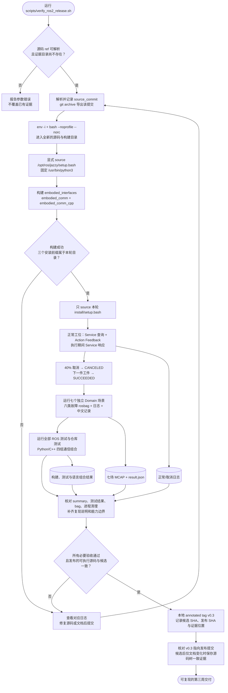

# 第 3 周第 7 天：干净终端演练与 v0.3 发布

本图把“当前机器能够运行”收敛为“指定 Git 提交能够从新终端重新构建、演示和回归”。发布标记必须保留实际验收的可执行源码；候选后的文档提交需要另存源码树一致性证据。

## Debug 顺序

1. 构建找不到接口：先查 `embodied_interfaces` 是否在归档提交中，再检查依赖顺序和本轮安装前缀。
2. 只有旧终端能运行：检查 `.bashrc`、Conda、旧 `AMENT_PREFIX_PATH` 是否遮住问题；以脚本的新环境结果为准。
3. 演示失败：先查本轮正常工位日志，确认 Domain、服务发现、目标参数和传感器新鲜度。
4. 故障矩阵失败：按第 6 天的 `result.json → diagnostics → Graph → Launch → rosbag` 顺序定位。
5. 测试汇总有失败：核对实际测试框架结果，不能把 `colcon test` 启动成功当作全部断言通过。
6. 验收后修改了可执行源码：重新提交并从新 SHA 演练；仅补文档/精简证据时，保存源码树哈希一致性证据。用 `git rev-parse 'v0.3^{commit}'` 确认最终标记。

对应实现与记录：

- [干净环境验收脚本](../../scripts/verify_ros2_release.sh)
- [四组语言组合验收](../../scripts/verify_ros2_language_pairs.py)
- [第 7 天实验与发布说明](../labs/week03-day7-release.md)
