# 第 3 周总流程：第 1～7 天集成系统

当前总图覆盖前七天的实现逻辑。它把同一件工件从任务提交、空间呈现、健康判断、故障分类和任务终止，延伸到自动留证、干净终端验收和固定版本交付。第 7 天的实际通过状态与发布 SHA 见对应实验记录。

```mermaid
flowchart TB
    START(["运行 verify_ros2_release.sh"]) --> D7PIN
    D7NORMAL --> DAY6SELECT["选择七个隔离故障场景<br/>每场使用独立 ROS_DOMAIN_ID"]

    subgraph D1["第 1 天：任务生命周期"]
        SENSOR["sensor_simulator"] -- "/sensor_state" --> CACHE["task_executor<br/>保存最新读数和接收时间"]
        OP["操作员或上层系统"] --> SERVICE["/execute_task<br/>即时查询"]
        CLIENT["inspection_demo"] --> GOAL{"Action Goal 合法<br/>且工位空闲？"}
        GOAL -- "否" --> REJECT["REJECTED"]
        GOAL -- "是" --> RUN["preparing → inspecting → validating<br/>持续 Feedback"]
        RUN --> CANCEL{"收到取消？"}
        CANCEL -- "是" --> CANCELED["CANCELED<br/>释放工位"]
        CANCEL -- "否" --> FINALCHECK["任务结束时读取传感器快照"]
        SERVICE --> SERVICEGATE{"Service 快照<br/>存在、新鲜且在有效范围？"}
        CACHE --> SERVICEGATE
        FINALCHECK --> ACTIONGATE{"Action 快照<br/>存在、新鲜且在有效范围？"}
        CACHE --> ACTIONGATE
        ACTIONGATE -- "是" --> SUCCEEDED["SUCCEEDED<br/>100% completed"]
        SERVICEGATE -- "是" --> SERVICEOK["Service success"]
        ACTIONGATE -- "否" --> ABORTED["ABORTED"]
        SERVICEGATE -- "否" --> SERVICEFAIL["Service false"]
        CANCELED --> TASKSTATUS["/task_status：每个终态一次"]
        SUCCEEDED --> TASKSTATUS
        ABORTED --> TASKSTATUS
        SERVICEOK --> TASKSTATUS
        SERVICEFAIL --> TASKSTATUS
    end

    subgraph D2["第 2 天：空间关系与可视化"]
        VIS["workcell_visualizer"] --> STATIC["/tf_static<br/>world → base_link<br/>camera_link → tool0"]
        VIS --> DYNAMIC["/tf<br/>base_link → camera_link"]
        VIS --> MARKER["/inspection_target_marker<br/>tool0 前方绿色检查区域"]
        STATIC --> TFBUFFER["TF Buffer 合成 world → tool0"]
        DYNAMIC --> TFBUFFER
        TFBUFFER --> RVIZ["RViz：Fixed Frame=world<br/>显示四帧树"]
        MARKER --> RVIZ
        RUN -. "当前并行运行，Action 尚不查询 TF" .-> RVIZ
    end

    subgraph D3["第 3 天：健康、故障和证据"]
        SENSOR -- "/sensor_state" --> MONITOR["status_monitor<br/>记录最后合法消息时间"]
        MONITOR --> WAITING["启动：/diagnostics<br/>WARN + waiting"]
        WAITING --> AGE
        AGE{"数据年龄达到 timeout_sec？"}
        AGE -- "否，且已有合法消息" --> HEALTHY["/diagnostics<br/>OK + healthy"]
        AGE -- "否，且尚无合法消息" --> WAITING
        AGE -- "是" --> STALE["/diagnostics<br/>ERROR + stale"]
        FAULT["fault_stop_after_sec 到达"] --> STOP["停止发布 Timer<br/>节点和 Publisher 保持在线"]
        STOP --> AGE
        STALE -. "同源现象；执行器不订阅 diagnostics" .-> ACTIONGATE
        STALE -. "执行器按自己的接收时间独立判断" .-> SERVICEGATE
        RECORDER["操作员另开终端<br/>启动 ros2 bag record"] -. "按需创建 Recorder" .-> BAG[("rosbag2 / MCAP")]
        SENSOR --> BAG
        WAITING --> BAG
        HEALTHY --> BAG
        STALE --> BAG
        TASKSTATUS --> BAG
    end

    subgraph D4["第 4 天：QoS 与空间故障分类"]
        QOSMODE{"传感器 Publisher<br/>可靠性模式"}
        QOSMODE -- "RELIABLE" --> QOSOK["与业务订阅端兼容"]
        QOSMODE -- "BEST_EFFORT" --> QOSBAD["端点存在但不匹配<br/>ERROR + qos_mismatch"]
        QOSOK --> MONITOR
        QOSBAD -. "没有业务数据" .-> AGE
        QOSBAD -. "执行器无合法快照" .-> SERVICEGATE
        QOSBAD -. "执行器无合法快照" .-> ACTIONGATE

        TFMODE{"tf_fault_mode"}
        TFMODE -- "normal" --> DYNAMIC
        TFMODE -- "missing" --> OMIT["从不发布<br/>base_link → camera_link"]
        TFMODE -- "stale" --> TFPAUSE["先正常发布<br/>到时停止刷新动态 TF"]
        OMIT --> SPATIAL["spatial_health_monitor<br/>独立 TF Buffer"]
        TFPAUSE --> SPATIAL
        DYNAMIC --> SPATIAL
        SPATIAL --> TFSTATE{"完整链存在且<br/>时间戳新鲜？"}
        TFSTATE -- "是" --> TFHEALTHY["TF 诊断<br/>OK + healthy"]
        TFSTATE -- "从未形成" --> TFMISSING["TF 诊断<br/>ERROR + missing"]
        TFSTATE -- "缓存存在但过期" --> TFSTALE["TF 诊断<br/>ERROR + stale"]
        TFMISSING --> RVIERR["RViz 子树断开<br/>tool0 Marker 不显示"]
        TFSTALE --> RVIERR2["RViz 可能出现旧数据/外推异常<br/>画面受缓存与更新时序影响"]
        TFMISSING -. "当前只报警，尚未接入任务门禁" .-> BOUNDARY["Day 4 能力边界"]
        TFSTALE -. "当前只报警，尚未接入任务门禁" .-> BOUNDARY
        QOSBAD --> BAG
        TFHEALTHY --> BAG
        TFMISSING --> BAG
        TFSTALE --> BAG
    end

    subgraph D5["第 5 天：接口期限、取消和进程故障"]
        SERVICE -. "fault_service_delay_sec > 0" .-> SVCDELAY["Server 回调延迟"]
        SVCDELAY --> DEADLINE{"客户端截止时间<br/>先到达？"}
        DEADLINE -- "是" --> SVCTIMEOUT["客户端超时<br/>退出码 6，结果未知"]
        SVCDELAY --> SERVICEGATE
        SERVICEGATE -. "Server 仍会完成" .-> TASKSTATUS

        DAY5CLIENT["inspection_demo<br/>cancel-at=40"] --> CANCELREQ["Action Cancel Request"]
        CANCELREQ --> CANCEL
        CANCELED --> RELEASE["释放单工位占用"]
        RELEASE --> NEXTGOAL["下一件工件 Goal"]
        NEXTGOAL --> GOAL

        CRASHFAULT["fault_sensor_crash_after_sec 到达"] --> CRASH["sensor_simulator 抛出异常<br/>process exit code 1"]
        CRASH --> LOSTENDPOINT["Node 与 Publisher 消失"]
        LOSTENDPOINT --> LOSTDIAG["传感器诊断<br/>ERROR + publisher_lost"]
        LOSTDIAG -. "执行器按自己的数据年龄判断" .-> SERVICEGATE
        LOSTDIAG -. "Action 结束检查" .-> ACTIONGATE
        CRASH -. "独立空间节点继续运行" .-> RVIZ
        SVCTIMEOUT --> FILELOG[("客户端与 Launch 文件日志<br/>期限、退出码、异常栈")]
        CRASH --> FILELOG
        CANCELED --> BAG
        LOSTDIAG --> BAG
    end

    subgraph D6["第 6 天：自动证据与回归"]
        D6REC["故障前启动 rosbag Recorder<br/>MCAP：业务 Topic + Action 状态 + /rosout"]
        D6LIVE["故障前启动常驻 diagnostics 观察器"]
        LAUNCH["每场启动 Day 5 → Day 4 → Day 3 → Day 2<br/>最终包含 three_nodes Launch"]
        D6READY{"本场五节点就绪？"}
        D6DRIVE["按场景等待定时注入<br/>或运行 Service/Action Client"]
        D6SNAP["采集 node/topic/service/action<br/>diagnostics/TF 快照"]
        D6STOP["先停止观察器和 Recorder<br/>再停止 Launch"]
        D6INFO{"bag 可读且消息数 > 0？<br/>退出码和关键字正确？"}
        D6RESULT["每场 result.json<br/>失败不阻断后续场景"]
        D6MORE{"还有场景？"}
        D6REG["colcon test + test-result<br/>仓库 Python 回归"]
        D6REPORT["summary.json + 故障记录.md<br/>六类七段式中文记录"]

        D6REC --> D6LIVE --> LAUNCH --> D6READY
        D6READY -- "是" --> D6DRIVE --> D6SNAP --> D6STOP --> D6INFO
        D6READY -- "否：记录失败并清理" --> D6STOP
        D6INFO --> D6RESULT --> D6MORE
        D6MORE -- "是：前场失败也继续" --> DAY6SELECT
        D6MORE -- "否" --> D6REG --> D6REPORT
    end

    subgraph D7["第 7 天：干净终端验收与版本追溯"]
        D7PIN["解析待验收 ref → candidate SHA<br/>git archive 导出源码"]
        D7FRESH["env -i + bash --noprofile --norc<br/>显式加载 Jazzy underlay"]
        D7BUILD["新目录构建三个 ROS 包<br/>验证接口导入与安装前缀"]
        D7NORMAL["正常工位演练：Service + Action + TF/diagnostics<br/>取消 → 工位释放 → 下一件成功"]
        D7PAIRS["四组 Python/C++ 通信组合<br/>核对正常、错连、修复"]
        D7CHECK["核对证据、全部测试与进程清理<br/>补齐中文说明和证据索引"]
        D7GATE{"全部验收通过<br/>发布的可执行源码与候选一致？"}
        D7FIX["修复后提交新候选<br/>有运行改动则重新演练"]
        D7TAG["本地 annotated tag v0.3<br/>记录候选 SHA / 发布 SHA<br/>文档提交另验源码树一致性"]

        D7PIN --> D7FRESH --> D7BUILD --> D7NORMAL
        D6REPORT --> D7PAIRS --> D7CHECK --> D7GATE
        D7GATE -- "否" --> D7FIX --> D7PIN
        D7GATE -- "是" --> D7TAG
    end

    DAY6SELECT --> D6REC
    LAUNCH --> SENSOR
    LAUNCH --> CACHE
    LAUNCH --> VIS
    LAUNCH --> MONITOR
    LAUNCH --> SPATIAL
    LAUNCH --> QOSMODE
    LAUNCH --> TFMODE
    OP -. "操作员启动取消演示" .-> DAY5CLIENT
    LAUNCH -. "故障参数大于 0 时启用" .-> FAULT
    LAUNCH -. "故障参数大于 0 时启用" .-> CRASHFAULT
    FAULT -. "自动场景参数" .-> D6DRIVE
    QOSBAD -. "自动场景参数" .-> D6DRIVE
    TFMODE -. "自动场景参数" .-> D6DRIVE
    SVCDELAY -. "自动场景参数" .-> D6DRIVE
    CANCELREQ -. "客户端驱动" .-> D6DRIVE
    CRASHFAULT -. "自动场景参数" .-> D6DRIVE
    BAG --> D6SNAP
    FILELOG --> D6INFO

    STALE --> DEBUG{"现场定位"}
    DEBUG --> ENDPOINT["node list + topic info<br/>节点和 Publisher 是否存在"]
    ENDPOINT --> FLOW["topic hz + echo<br/>消息序号是否继续变化"]
    FLOW --> QOS["核对 QoS<br/>再结合注入日志确认根因"]
    QOS --> CROSSCHECK["按 status.name 分链<br/>传感器状态与 TF 状态交叉检查"]
    CROSSCHECK --> TFDEBUG["tf2_echo 完整链与局部链<br/>核对动态时间戳年龄"]
    TFDEBUG --> REPLAY["bag info + bag play<br/>还原断流、报警、任务失败顺序"]
    REPLAY --> RECOVERY["关闭故障参数并重启<br/>新数据使 diagnostics 回到 OK<br/>executor 独立新鲜度检查重新通过"]
    RECOVERY --> TESTS["全量回归<br/>Action + Service + TF/RViz + diagnostics + 七故障场景"]
    TESTS --> D6REG
```

## 如何用总图 Debug

1. 任务没有开始：沿第 1 天检查 Action Server、目标参数和单工位占用。
2. 任务能运行但 RViz 不显示：沿第 2 天拆查 `/tf_static`、`/tf`、Marker QoS 和 Fixed Frame。
3. 节点在线但任务突然失败：沿第 3 天检查消息频率、数据年龄、diagnostics 和 rosbag 时间线。
4. Publisher 存在但从未有业务数据：沿第 4 天比较 Offered/Requested QoS，不要把它误判为断流。
5. RViz 子树断开或目标消失：沿第 4 天区分完整链从未形成的 `missing` 与时间戳停止增长的 `stale`。
6. RViz 正常但任务被联锁：优先检查传感器链；空间链健康不等于测量数据新鲜。
7. TF 报警但任务仍执行是当前明确边界：空间诊断尚未接入 Action 门禁。
8. Service 客户端超时：检查 Server 后续是否仍完成，不能把超时直接解释为执行失败。
9. Action 取消：确认终态为 `CANCELED`、工位释放且下一目标可以接受。
10. Node 和 Publisher 同时消失：结合 `publisher_lost` 与 Launch 退出码定位进程崩溃。
11. 修复后必须从恢复节点走到全量回归，不能只看一次 Service 成功。
12. 自动流水线失败时先看单场 `result.json`，再按 diagnostics、Graph、Launch、bag 的顺序交叉定位。
13. rosbag 只能回放消息时间线；Service 客户端超时和进程退出必须结合文件日志。
14. 干净环境失败而旧终端成功：沿第 7 天查归档提交、接口包依赖、安装前缀和隐含环境变量。
15. 发布版本与证据不一致：核对候选 SHA、发布 SHA 及可执行源码树一致性；运行源码有变化就重新验收。

分日细节：

- [第 1 天：长任务 Action](week03-day01-action.md)
- [第 2 天：TF 与 RViz](week03-day02-tf-rviz.md)
- [第 3 天：健康诊断与话题停止](week03-day03-health-topic-stop.md)
- [第 4 天：QoS、话题停止与 TF 故障](week03-day04-qos-tf-faults.md)
- [第 5 天：Service 超时、Action 取消与节点崩溃](week03-day05-service-action-crash.md)
- [第 6 天：自动 rosbag、日志与回归证据](week03-day06-automated-evidence.md)
- [第 7 天：干净终端演练与 v0.3 发布](week03-day07-release.md)
