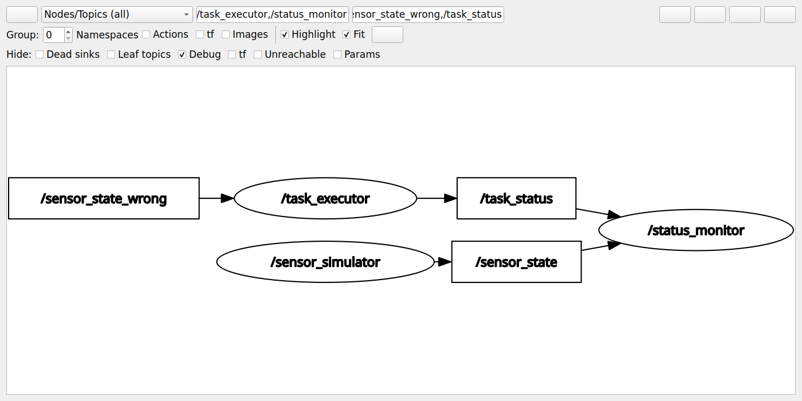

# 阶段⑤：节点都在，为什么执行器没有数据？

## 实验设计与判定标准

每次先关闭前一个 Launch，再启动全新进程，避免执行器缓存旧读数。三次运行唯一的业务配置差异是执行器输入重映射；传感器与监控器的配置相同。

| 配置 | `/sensor_state` 发布/订阅 | `/sensor_state_wrong` 发布/订阅 | 服务结果 |
|---|---|---|---|
| 正常 | 1 / 2 | 无此业务话题 | 成功 |
| 错误 | 1 / 1 | 0 / 1 | 失败：没有有效传感器数据 |
| 修复 | 1 / 2 | 无此业务话题 | 成功 |

三种配置均有三个业务节点，`/task_status` 均为 1 发布端、1 订阅端；监控器始终收到传感器消息和本次任务结果。话题类型均为 `std_msgs/msg/String`。执行服务是 `std_srvs/srv/Trigger`。

错误的根因：传感器发布到 `/sensor_state`，但执行器订阅 `/sensor_state_wrong`。名称不同导致执行器没有输入，节点进程存在并不保证通信关系正确。

修复：删除错误的 `executor_sensor_topic` 覆盖值，重启默认 Launch，使执行器重新订阅 `/sensor_state`。

## 你现在可以按顺序手动验收

先关闭之前的 Launch。每个新终端加载相同环境：

```bash
conda activate embodied-agent-lab
source /opt/ros/jazzy/setup.bash
source /home/fatbro/workspace/ros2_ws/install/setup.bash
```

### 1. 正常运行

终端 A：

```bash
ros2 launch embodied_comm three_nodes.launch.py
```

终端 B：

```bash
ros2 node list --no-daemon --spin-time 5
ros2 topic info /sensor_state --verbose --no-daemon --spin-time 5
ros2 topic info /task_status --verbose --no-daemon --spin-time 5
ros2 node info /task_executor --no-daemon --spin-time 5
ros2 service call /execute_task std_srvs/srv/Trigger "{}"
```

先等待执行器收到读数再调用服务。核对上表正常行，并观察 A 的监控器显示成功任务结果。CLI 发现可能稍有延迟，首次查不到时等待后重新查询。

### 2. 制造错误并定位

在 A 按 Ctrl+C，确认上一组节点退出，再执行：

```bash
ros2 launch embodied_comm three_nodes.launch.py executor_sensor_topic:=/sensor_state_wrong
```

在 B 重复节点、话题与执行器信息查询，再增加：

```bash
ros2 topic info /sensor_state_wrong --verbose --no-daemon --spin-time 5
ros2 service call /execute_task std_srvs/srv/Trigger "{}"
```

应看到：三个节点都存在；正常传感器话题只剩监控器一个订阅者；错误话题没有发布者，只有执行器订阅；服务返回 `success=False`。监控器仍收到递增传感器消息，并显示失败任务结果。

这时用以下命令进一步证明传感器本身仍正常（放在端点统计后运行）：

```bash
ros2 topic echo /sensor_state std_msgs/msg/String --once
ros2 topic hz /sensor_state
```

频率应接近默认 2 Hz。按 Ctrl+C 退出 hz，避免临时订阅影响后续端点数量。

### 3. 修复并复验

在 A Ctrl+C，再恢复默认命令：

```bash
ros2 launch embodied_comm three_nodes.launch.py
```

在 B 重复正常运行的查询和服务调用。应恢复 1 发布端、2 订阅端，服务成功，监控器显示成功结果。服务成功来自响应证据，不能只根据图判断。

## rqt_graph 如何看

另一个已加载 ROS 环境的终端运行：

```bash
ros2 run rqt_graph rqt_graph
```

选择 `Nodes/Topics (all)`。取消隐藏 `Dead sinks`、`Leaf topics` 和 `Unreachable`，否则只有订阅者的错误话题可能被隐藏。保留 Debug 过滤可减少 `/rosout`、参数事件等背景信息。每次配置变化后点击刷新，分别保存正常、错误、修复截图。

本次提供的 PNG 是本机已安装的 Jazzy `rqt_graph` 插件根据实时 ROS 图生成的实际 Qt 窗口截图，使用离屏 Qt 环境采集，不是手绘架构图；同时保留插件生成的原始 DOT。截图筛选三个业务节点及相关话题。采图程序只做图查询，不订阅业务话题；在端点统计、echo/hz 结束后采图。

## 自动复现实验

已增加两个实验脚本，不修改业务节点：

- `scripts/verify_ros2_connections.py`：顺序启动正常、错误、修复配置，断言节点/端点/服务/监控行为，保存原始日志和截图。
- `scripts/capture_ros2_graph.py`：使用系统 Python 加载实际 rqt_graph 插件并截图。依赖本机 rqt_graph、Qt 和 Graphviz，使用插件内部接口，ROS 升级后需复验。

先构建并加载工作空间，再执行（输出应使用一个新目录，默认使用空闲域 186～188）：

```bash
cd /home/fatbro/workspace
source /opt/ros/jazzy/setup.bash
source ros2_ws/install/setup.bash
/usr/bin/python3 scripts/verify_ros2_connections.py \
  --output /tmp/embodied-stage5-my-evidence
```

脚本只关闭自己启动的进程组，不关闭你其他终端的节点。测试前确保三个指定域没有其他实验；可通过 `--domain-start` 换一组域。为了发现节点和测频，完整实验需要数分钟。业务节点在每个案例结束后退出。

## 本次验收证据（2026-09-19）

| 配置 | 真实 rqt_graph 窗口截图 | 服务调用结果 | 端点证据 |
|---|---|---|---|
| 正常 | [正常图](evidence/week02-stage5/normal/rqt_graph.png) | [成功响应](evidence/week02-stage5/normal/service.log) | [1 发布、2 订阅](evidence/week02-stage5/normal/sensor-topic.log) |
| 错误 | [错误图](evidence/week02-stage5/wrong/rqt_graph.png) | [无数据失败](evidence/week02-stage5/wrong/service.log) | [正常话题](evidence/week02-stage5/wrong/sensor-topic.log)、[错误话题 0 发布、1 订阅](evidence/week02-stage5/wrong/wrong-topic.log) |
| 修复 | [修复图](evidence/week02-stage5/repaired/rqt_graph.png) | [恢复成功](evidence/week02-stage5/repaired/service.log) | [恢复 1 发布、2 订阅](evidence/week02-stage5/repaired/sensor-topic.log) |

三种配置均实测平均频率 2.000 Hz；监控器分别收到成功、失败、成功结果。已逐张检查截图，并核对原始 DOT 的五条实际连接与预期一致，见 [实测汇总](evidence/week02-stage5/summary.json)。正常与修复图布局可以不同，连接关系相同。

每个案例目录还保留 `configuration.json`（启动命令和隔离域）、`nodes.log`、`executor-node.log`、`task-topic.log`、`sensor-message.log`、`frequency.log`、`launch.log`、`rqt_graph.dot` 和截图工具日志。



错误图中 `/sensor_state_wrong → task_executor` 的箭头表示执行器注册了该话题的订阅，不表示话题真的有消息。结合错误话题“0 个发布端”和服务失败响应，才能完成判断。任务状态连接仍存在，所以监控器也能收到失败结果。

本阶段保留业务代码不变，新增的复现脚本完成三种场景的实际断言与截图采集。阶段④的 37 项测试结果是此前回归基线，不把它写成本轮重新运行结果。本次新增脚本通过语法检查，运行证据来自三次真实 Launch 实验。

下一步：你按上面的命令手动复现“正常 → 错误 → 修复”，能解释每次端点数量与服务结果后，进入阶段⑥，完成剩余验收、C++ 对照、源码复现与发布准备。本次未提交 Git，也未标记 v0.2。
