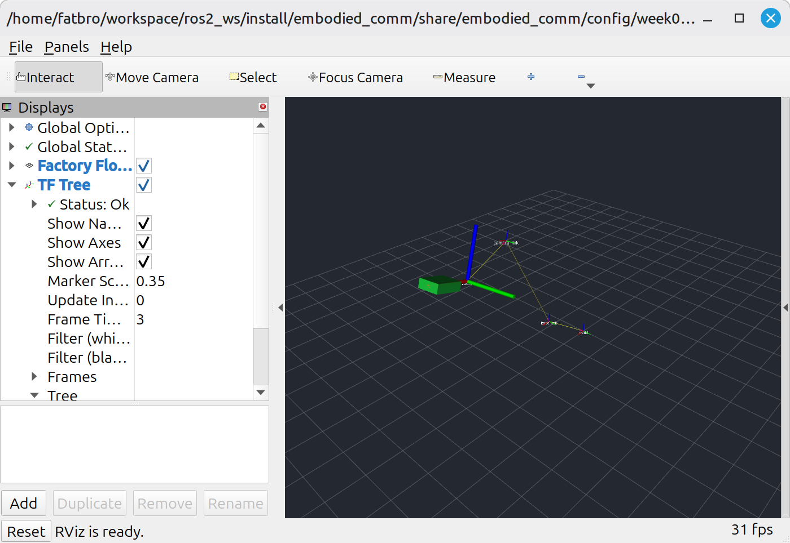
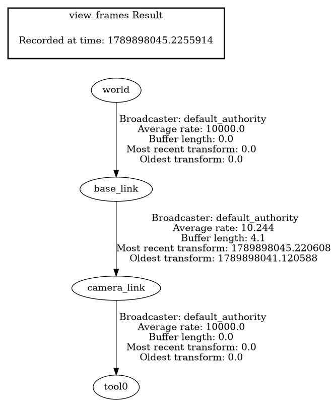

# 第 3 周第 2 天：正常坐标树与工业质检工位可视化

> 实现路径与画面调试顺序见[第 2 天 TF/RViz 流程图](../flowcharts/week03-day02-tf-rviz.md)，跨天关系见[第 1～7 天总流程图](../flowcharts/week03-overall.md)。

## 1. 今天完成了什么

第二天把第 1 天的长任务放进了一个可观察的空间场景。新增的 `workcell_visualizer` 节点发布正常 TF 坐标树和质检目标 Marker；`week03_day2.launch.py` 一次启动原有通信系统、Action、坐标发布器和 RViz。

```text
world
  └─ base_link
       └─ camera_link
            └─ tool0
                 └─ 前方 0.25 m：绿色质检区域 Marker
```

这一天解决的是“系统中的测量和动作发生在哪里”。它没有提前实现机器人模型、视觉算法或机械臂控制。

## 2. 坐标树契约

| 变换 | 类型 | 平移 | 旋转 | 工业含义 |
|---|---|---|---|---|
| `world → base_link` | 静态 `/tf_static` | `(0.20, -0.20, 0.10) m` | 单位四元数 | 质检工位相对车间标定原点的位置 |
| `base_link → camera_link` | 动态 `/tf`，默认 10 Hz | `(0.45, 0.00, 0.85) m` | RPY `(0°, -20°, 10°)` | 工位上方相机或测量单元的位置与朝向 |
| `camera_link → tool0` | 静态 `/tf_static` | `(0.35, 0.00, -0.25) m` | 单位四元数 | 与相机刚性安装的检查头外参 |

`base_link → camera_link` 在今天的数值不移动，但时间戳持续刷新。这样既表达了“传感器位姿仍在在线更新”，也为后续停止发布并观察 TF 过期留下了明确入口。其余两条刚性关系只发布一次，由 `/tf_static` 的持久 QoS 提供给后来加入的节点。

Marker 使用 `visualization_msgs/msg/Marker`：

- 话题：`/inspection_target_marker`；
- 参考坐标：`tool0`；
- 形状：绿色立方体，尺寸 `0.20 × 0.14 × 0.06 m`；
- 位置：检查头局部 X 轴前方 `0.25 m`；
- QoS：Reliable + Transient Local；
- `frame_locked=true`，TF 更新时画面跟随坐标系。

## 3. 构建和启动

```bash
conda activate embodied-agent-lab
source /opt/ros/jazzy/setup.bash
cd ros2_ws
colcon build --symlink-install --packages-up-to embodied_comm embodied_comm_cpp
source install/setup.bash
ros2 launch embodied_comm week03_day2.launch.py
```

默认会打开 RViz。无图形环境或自动化测试使用：

```bash
ros2 launch embodied_comm week03_day2.launch.py use_rviz:=false
```

完整启动包含：

- `/sensor_simulator`：生成替代工业测量值的模拟数据；
- `/task_executor`：提供快速 Service 和长任务 Action；
- `/status_monitor`：观察任务终态与传感器健康；
- `/workcell_visualizer`：发布 TF 和 Marker；
- `/rviz2`：显示工位空间关系。

## 4. 如何读 RViz 画面

RViz 固定坐标设为 `world`。黄色连线表示父子坐标关系，红、绿、蓝轴分别表示每个坐标系的 X、Y、Z 方向，绿色方块表示当前检查区域。左侧 `TF Tree` 的 `Status: Ok` 说明 RViz 能从 `world` 沿整条链找到 `tool0`。



独立生成的坐标关系图：



[下载 TF 树 PDF](evidence/week03-day2/tf-tree.pdf)

## 5. 命令行验证

新终端必须再次加载 ROS 和工作空间：

```bash
source /opt/ros/jazzy/setup.bash
cd ros2_ws
source install/setup.bash
```

查看 `world` 到检查头的合成变换：

```bash
ros2 run tf2_ros tf2_echo world tool0
```

实测结果约为平移 `(1.058, -0.128, 0.835) m`、RPY `(0°, -20°, 10°)`。命令刚启动时可能先出现一次“frame does not exist”，这是进程尚在完成 DDS 发现；随后持续输出变换才是最终判断依据。

生成整棵树：

```bash
ros2 run tf2_tools view_frames -t 5 -o /tmp/week03_day2_frames
```

`view_frames` 把静态边显示为 `10000 Hz` 是工具对静态 TF 的表示惯例，不代表节点在以该频率重复发布。

检查 Marker 内容和 QoS：

```bash
ros2 topic echo /inspection_target_marker visualization_msgs/msg/Marker \
  --qos-durability transient_local --qos-reliability reliable --once
```

## 6. 工业场景推演：一件工件从“任务”进入“空间”

场景是一条工件质检与分拣产线：

```text
WP-DAY2 到达工位
  → world 给出全产线统一基准
  → base_link 确定本质检站的位置
  → camera_link 表示测量单元的在线位姿
  → tool0 表示检查头的刚性安装位置
  → 绿色 Marker 标出检查头前方的检查区域
  → Action 执行准备、扫描、验证并返回结果
```

保持 RViz 开启，在另一终端运行：

```bash
ros2 run embodied_comm inspection_demo \
  --task-name inspect_workpiece_WP-DAY2 \
  --duration 5
```

真实产线中，相机可能在自己的 `camera_link` 坐标中报告缺陷点。完整 TF 链可以把这个点转换到 `world` 或机器人底座坐标，供机械臂抓取或分拣。今天的绿色方块先替代该检查区域，使坐标契约、发布频率、QoS、RViz 配置和任务通信能够在没有硬件时稳定验证。

本次实测中，Action 在同一场景内以 `SUCCEEDED` 结束并返回传感器序号；RViz 同时保持整条 TF 链为 OK。这证明任务通信和空间可视化可以并行运行。

## 7. 为什么这对后续故障诊断重要

正常基线必须先稳定，故障画面才有意义：

- 缺失 `camera_link` 时，`tool0` 和绿色 Marker 将无法从 `world` 定位；
- 动态 `base_link → camera_link` 停止刷新后，缓存最终会过期；
- 静态外参若配置错误，链仍可能显示为 OK，但 Marker 会出现在错误位置；
- Marker QoS 不匹配时，TF 正常而目标可能不显示。

后续故障注入会以今天的正常截图、坐标数值和自动化测试作为对照，按“现象→检查命令→画面→日志→根因→修复→回归测试”记录。

## 8. 自动化验证

```bash
source /opt/ros/jazzy/setup.bash
cd ros2_ws
source install/setup.bash
colcon test --packages-select embodied_interfaces embodied_comm embodied_comm_cpp
colcon test-result --all --verbose
```

测试不是只检查 Python 对象，而是使用真实 ROS 节点、DDS、TF Buffer 和安装后的 Launch：

- 完整 `world → tool0` 变换可查询，各段平移和旋转正确；
- 动态相机时间戳递增，静态检查头时间戳保持不变；
- Marker 的坐标、形状、颜色、锁帧与 QoS 正确；
- 安装后的 Day 2 Launch 能同时提供四个节点、TF、Marker、原有 Service 和 Action；
- 无 RViz 模式能干净退出；
- 实际 RViz 压力下发现并修复了传感器回调乱序风险：传感器订阅改为互斥回调组，请求接口仍使用可重入回调组。

本次全量实测：ROS 测试结果报告 79 项、根项目 18 项，合计 97 项通过，0 错误、0 失败、0 跳过。ROS 的 79 项包含一个 CTest 包装条目，因此按独立测试用例计为 96 项。

## 9. 当前能力边界

已经具备：

- 可重复发布、查询和显示一棵正常工业工位坐标树；
- 在工具坐标中表达一个随 TF 更新的检查区域；
- 把第 1 天 Action 与空间可视化放进同一个可运行场景；
- 用真实 TF Buffer、Launch 和 RViz 验证正常基线。

尚未具备：

- 没有 URDF 机器人模型、真实相机标定、图像或点云；
- 没有 PLC、传送带、机械臂控制器或安全认证回路；
- Marker 是合成检查区域，不是算法识别出的真实工件或缺陷；
- Action 当前不读取或校验 TF，任务成功不能证明空间定位正确；
- 今天只完成正常基线，缺失或过期 TF 的可视故障属于后续任务。

因此，第二天交付的是工业空间关系的可观察骨架。它让你现在就能看到“工位、相机、检查头和目标之间是什么关系”，也为之后可控地破坏这条关系并学习诊断建立可信基准。

## 10. 实测证据

构建测试、TF 数值、Marker、Action、坐标图和 RViz 截图位于 [`evidence/week03-day2`](evidence/week03-day2/README.md)。
